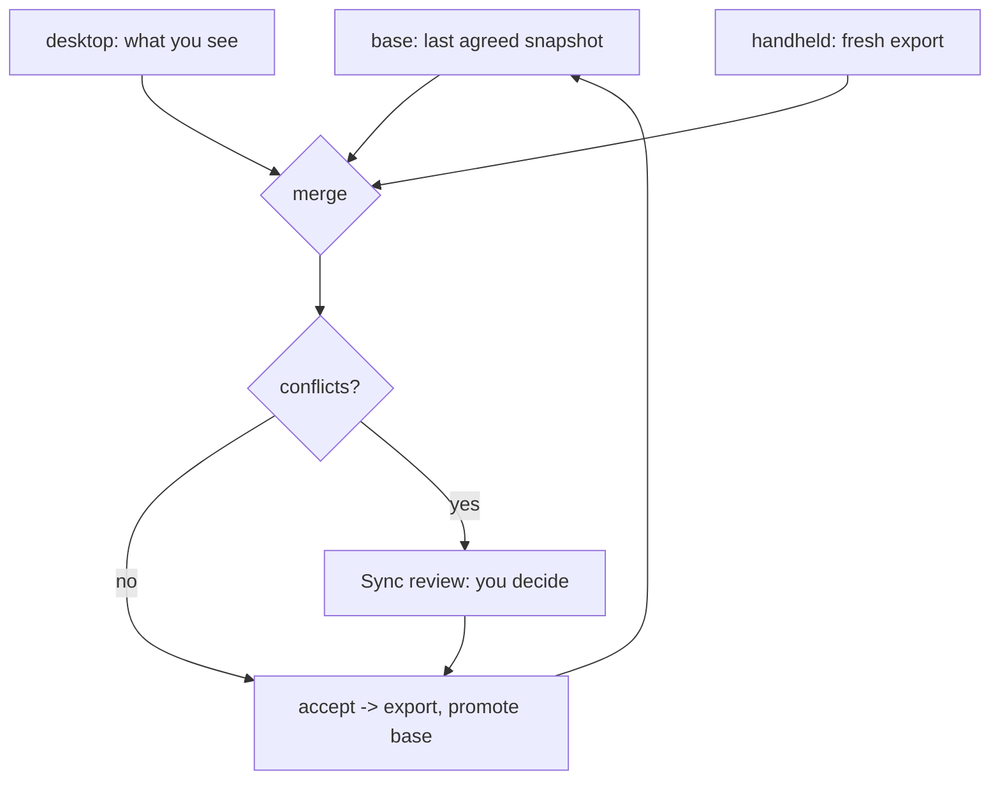

# Scantron Desktop

A WPF front end for the Scantron container inventory, sitting on top of
[`Scantron.Core`](../Scantron.Core) - the shared contract layer that parses, validates and
merges Scantron export documents.

The Android app on the CK65 is the other half of this. The desktop is where an operator
reconciles what a warehouse scanned with what the desk knows, and exports a file the handheld
will import.

---

## Table of Contents

1. [Running it](#-running-it)
2. [The sync workflow](#-the-sync-workflow)
3. [What the three panes do](#-what-the-three-panes-do)
4. [Where files live](#-where-files-live)
5. [Keyboard shortcuts](#-keyboard-shortcuts)
6. [Rules this app will not break](#-rules-this-app-will-not-break)
7. [Project layout](#-project-layout)
8. [Building and testing](#-building-and-testing)

---

## Running it

```bash
dotnet run --project Scantron.Desktop
```

Published as a single self-contained executable - no .NET install needed on the target machine:

```bash
dotnet publish Scantron.Desktop -c Release -o artifacts/publish
# -> artifacts/publish/Scantron.Desktop.exe
```

---

## The sync workflow

The merge is **three-way**, not two-way, and that is the whole point. "Changed" is undefined
without a baseline: given only the desktop and the handheld you cannot tell a deliberate edit
from a row nobody touched. So the app keeps the last state both sides agreed on and merges
against it.



In practice:

1. **Open** an export (or work from the restored workspace).
2. Edit containers and items freely. Every edit advances the row's `updatedAt`, which is how the
   merger knows you changed it.
3. **Import from handheld...** to merge a fresh CK65 export.
4. Review anything in the **Sync review** pane. A field where both sides changed to *different*
   values is a conflict, and is never resolved automatically.
5. **Accept** applies your decisions and promotes the result to the new baseline.

> [!IMPORTANT]
> A conflict is reported, never guessed. Picking either side silently loses data, and the
> operator has better context than the code does. Accept is disabled until every conflict has a
> decision.

---

## What the three panes do

| Pane | Purpose |
| --- | --- |
| **Containers** | Tags, labels and locations. Shows per-container unit totals and a warning badge for rows still missing a uuid. |
| **Items** | The rows for the selected container, plus its metadata editor. Editable in place. |
| **Sync review** | Conflicts from the last merge, the decision buttons, and an activity log. |

---

## Where files live

All paths are relative to the executable's directory.

| File | Purpose |
| --- | --- |
| `workspace.current.json` | The document you are editing. |
| `workspace.base.json` | Last mutually-agreed snapshot - the third merge input. |
| `scantron.log` | Tiered diagnostic log (timestamp, level, pid). |

Both workspace files are written in the **device export format** and parsed by
`InventoryReader`, deliberately. Two reasons: an operator can inspect either one in a text
editor, and the store cannot drift from what an export produces. They are also written via a
temporary file and then moved into place, so a crash mid-save leaves the previous good copy
rather than a truncated one.

---

## Keyboard shortcuts

| Key | Action |
| --- | --- |
| `Ctrl+N` | New document |
| `Ctrl+O` | Open an export |
| `Ctrl+S` | Export for the handheld |
| `Ctrl+I` | Import from the handheld |
| `Ctrl+D` | Add container |
| `Ctrl+Enter` | Accept the pending merge |

---

## Rules this app will not break

These are enforced in code and pinned by tests, because each one costs real stock when violated.

- **Nothing is exported that the handheld would reject.** `InventoryFileService.TrySave`
  validates against the device's own rules before writing, and refuses on failure. An export the
  device rejects is worse than no export: it looks successful until someone tries to import it in
  the aisle.
- **Conflicts are never auto-resolved.** A true conflict needs a human.
- **A merge is held until it is accepted.** The merge runs immediately but is not applied, so
  previewing is free and applying is deliberate.
- **Opening a file sets it as the baseline.** Otherwise re-importing a file you just exported
  would report every row as newly changed.
- **Every row leaves the desktop with a uuid.** Mints are applied on write-out, so an untouched
  legacy row cannot quietly merge with another by name.
- **Absence is not a verdict.** A container or row missing from one side is carried forward, not
  deleted on a guess.
- **Clock skew is surfaced, not silently trusted.** If a timestamp is implausibly far from the
  local clock the app warns that recency-based reasoning is unreliable.
- **Duplicate uuids are never collapsed.** Two rows sharing one uuid are both preserved, matching
  the device's `assignMissingItemUuids` behaviour, which re-mints rather than merging. The UI
  maps items one-to-one and never re-groups by uuid.

---

## Project layout

```text
Scantron.Desktop/
  Mvvm/          ObservableObject, RelayCommand, RelayCommand<T>
  Services/      ConflictResolver, InventoryFileService, WorkspaceStore, Log
  ViewModels/    MainViewModel, Container/Item/Conflict view models
  Views/         MainWindow, converters
```

`Scantron.Desktop` depends on `Scantron.Core` and nothing else. There is no MVVM framework and
no file-dialog abstraction package: the view model takes paths rather than dialogs, which is
what lets the entire import-merge-resolve-accept path be tested without WPF.

---

## Building and testing

```bash
dotnet build                       # whole solution
dotnet test                        # 88 tests
dotnet run --project Scantron.Desktop
```

`Scantron.Desktop.Tests` covers the parts where a mistake loses stock: conflict-to-row mapping
(including the ambiguous legacy case that is refused rather than guessed), baseline persistence,
the export validation gate, and the full merge workflow driven through the view model.
</path><file_text>