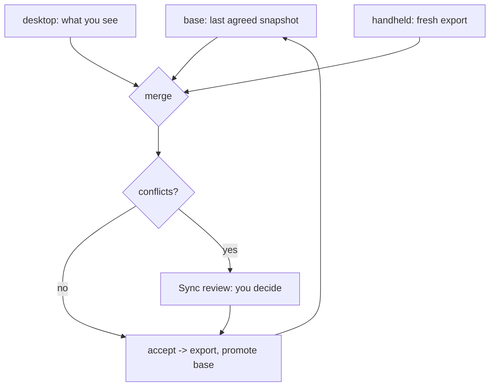

# Scantron Desktop

A WPF front end for the Scantron container inventory, sitting on top of
[`Scantron.Core`](../Scantron.Core) - the shared contract layer that parses, validates and
merges Scantron export documents.

The Android app on the CK65 is the other half of this. The desktop is where an operator
reconciles what a warehouse scanned with what the desk knows, and exports a file the handheld
will import.

---

## Table of Contents

1. [Running it](#-running-it)
2. [The sync workflow](#-the-sync-workflow)
3. [Transferring over Wi-Fi](#-transferring-over-wi-fi)
4. [What the three panes do](#-what-the-three-panes-do)
5. [Where files live](#-where-files-live)
6. [Keyboard shortcuts](#-keyboard-shortcuts)
7. [Rules this app will not break](#-rules-this-app-will-not-break)
8. [Project layout](#-project-layout)
9. [Building and testing](#-building-and-testing)

---

## Running it

```bash
dotnet run --project Scantron.Desktop
```

Published as a single self-contained executable - no .NET install needed on the target machine:

```bash
dotnet publish Scantron.Desktop -c Release -o artifacts/publish
# -> artifacts/publish/Scantron.Desktop.exe
```

---

## The sync workflow

The merge is **three-way**, not two-way, and that is the whole point. "Changed" is undefined
without a baseline: given only the desktop and the handheld you cannot tell a deliberate edit
from a row nobody touched. So the app keeps the last state both sides agreed on and merges
against it.



In practice:

1. **Open** an export (or work from the restored workspace).
2. Edit containers and items freely. Every edit advances the row's `updatedAt`, which is how the
   merger knows you changed it.
3. **Import from handheld...** to merge a fresh CK65 export.
4. Review anything in the **Sync review** pane. A field where both sides changed to *different*
   values is a conflict, and is never resolved automatically.
5. **Accept** applies your decisions and promotes the result to the new baseline.

> [!IMPORTANT]
> A conflict is reported, never guessed. Picking either side silently loses data, and the
> operator has better context than the code does. Accept is disabled until every conflict has a
> decision.

---

## What the three panes do

| Pane | Purpose |
| --- | --- |
| **Containers** | Tags, labels and locations. Shows per-container unit totals and a warning badge for rows still missing a uuid. |
| **Items** | The rows for the selected container, plus its metadata editor. Editable in place. |
| **Sync review** | Conflicts from the last merge, the decision buttons, and an activity log. |

---

## Transferring over Wi-Fi

Files can move between the handheld and this PC over a shared network, with no USB cable and no
cloud. It is a transfer, not a live sync: the same JSON documents a stick would carry, moved over
HTTP instead.

**The desktop hosts; the handheld connects.** The CK65 is a battery-powered warehouse device that
cannot be relied on to hold a listening socket, while this PC is on and on the network. More to the
point, the three-way merge, the baseline and the conflict review all live here - so a
handheld-hosted hub would mean pushing merge state backwards over the wire.

### Using it

1. Click **Start sharing**. The status bar shows the address, e.g. `Transfer: Sharing at
   http://192.168.1.50:8756`. If the PC has more than one network address they are all listed,
   most likely to work first - an APIPA (`169.254.x.x`) address, if there is one, is listed last
   because it is the one that works least often.
2. On the CK65, open **Transfer**, type that address in, and press **Send to desktop** or **Get
   from desktop**. **Find desktops** can locate the PC automatically if discovery is available.
3. Anything the handheld sends lands in **Sync review**, exactly like a file import. Nothing is
   applied until you accept it.

#### If the handheld says it cannot reach the desktop

The hub binds `0.0.0.0:8756` - every interface - so **no URL ACL reservation and no elevation is
needed**, and no `netsh http add urlacl` step. It needs no package either: the socket is a
`TcpListener` with a small HTTP/1.1 reader and writer in `Services/Transfer/TcpHttpListener.cs`.

If the desktop is running as a normal user and the handheld still cannot connect, the cause is
almost always the Windows Firewall blocking inbound TCP 8756 on the **Private** network profile.
Check that first:

```powershell
Get-NetFirewallProfile -Profile Private | Select-Object Enabled,AllowInboundRules
Get-NetFirewallRule -ErrorAction SilentlyContinue |
    Where-Object DisplayName -like '*Scantron*' | Select-Object DisplayName,Enabled,Action
```

Allowing the app on the Private profile is enough. Note that the hub listens on all profiles, so
on a shared warehouse network it is reachable by anything on that network that is not blocked -
which is why nothing listens at all until you click **Start sharing**, and why **Stop sharing**
really closes the port.

Transfers are started from the handheld in both directions, because a pull is destructive on the
device - it clears and replaces its whole database. So the desktop never initiates one, and
**Pull from handheld** explains where to go rather than pretending to fetch. **Send to handheld**
publishes the current document so the scanner can collect it.

### The wire contract

| Method | Path | Body |
| --- | --- | --- |
| `GET` | `/health` | plain text - is this the right machine, and is it sharing |
| `POST` | `/push` | the unmodified Scantron export document |
| `GET` | `/pull` | the unmodified Scantron export document |

The body *is* the ordinary export file, with no envelope around it. Both ends already parse and
validate exactly this document, so wrapping it would mean a second place for the two halves to
disagree - and a file pushed over Wi-Fi has to be interchangeable with the same file moved over
USB, which is surest when the bytes are the same bytes.

### Security posture

Plain HTTP with no authentication, on a closed network with no internet path. Adding TLS to a
certificate-less self-signed setup on a CK65 costs more here than it buys.

Within that, three things are enforced:

- **Nothing listens until you ask.** The hub is inert at startup and closes the moment you switch
  sharing off, so an endpoint that can read and overwrite the day's stock count does not outlive
  the shift that needed it.
- **Every document is validated before use.** Nothing is written and no merge happens on bytes
  that have not been through the same reader and validator a file import would.
- **Bodies are capped at 16 MB**, refused on arrival, so a malformed request cannot exhaust the
  memory of the machine holding the inventory.

---

## Where files live

All paths are relative to the executable's directory.

| File | Purpose |
| --- | --- |
| `workspace.current.json` | The document you are editing. |
| `workspace.base.json` | Last mutually-agreed snapshot - the third merge input. |
| `inbox\push-*.json` | Every transfer the handheld sent, kept for the last 20 pushes. |
| `scantron.log` | Tiered diagnostic log (timestamp, level, pid). |

Both workspace files are written in the **device export format** and parsed by
`InventoryReader`, deliberately. Two reasons: an operator can inspect either one in a text
editor, and the store cannot drift from what an export produces. They are also written via a
temporary file and then moved into place, so a crash mid-save leaves the previous good copy
rather than a truncated one.

---

## Keyboard shortcuts

| Key | Action |
| --- | --- |
| `Ctrl+N` | New document |
| `Ctrl+O` | Open an export |
| `Ctrl+S` | Export for the handheld |
| `Ctrl+I` | Import from the handheld |
| `Ctrl+D` | Add container |
| `Ctrl+Enter` | Accept the pending merge |
| `Ctrl+P` | Send to handheld - make this document available for the scanner to pull |

---

## Rules this app will not break

These are enforced in code and pinned by tests, because each one costs real stock when violated.

- **Nothing is exported that the handheld would reject.** `InventoryFileService.TrySave`
  validates against the device's own rules before writing, and refuses on failure. An export the
  device rejects is worse than no export: it looks successful until someone tries to import it in
  the aisle.
- **Conflicts are never auto-resolved.** A true conflict needs a human.
- **A merge is held until it is accepted.** The merge runs immediately but is not applied, so
  previewing is free and applying is deliberate.
- **Opening a file sets it as the baseline.** Otherwise re-importing a file you just exported
  would report every row as newly changed.
- **Every row leaves the desktop with a uuid.** Mints are applied on write-out, so an untouched
  legacy row cannot quietly merge with another by name.
- **Absence is not a verdict.** A container or row missing from one side is carried forward, not
  deleted on a guess.
- **Clock skew is surfaced, not silently trusted.** If a timestamp is implausibly far from the
  local clock the app warns that recency-based reasoning is unreliable.
- **Duplicate uuids are never collapsed.** Two rows sharing one uuid are both preserved, matching
  the device's `assignMissingItemUuids` behaviour, which re-mints rather than merging. The UI
  maps items one-to-one and never re-groups by uuid.
- **A transfer never becomes a second merge path.** An inbound push goes through the same
  `MergeDocument` call a file import uses, so a rule changed for imports cannot leave transfers
  behaving differently. A test pins the two to the same result.
- **Nothing is listening until you start sharing.** The hub is inert at startup.
- **An empty document is never sent to a device that would read it as "delete everything".** With
  no document loaded, `/pull` answers `503` and says so. A deliberately empty document the
  operator created is still served, because there the emptiness was asked for.
- **A pull is never started from this side.** It is destructive on the handheld, which clears and
  replaces its database, so both directions are initiated on the device.

---

## Project layout

```text
Scantron.Desktop/
  Mvvm/          ObservableObject, RelayCommand, RelayCommand<T>
  Services/      ConflictResolver, InventoryFileService, WorkspaceStore, Log
  Services/Transfer/
                 HubEndpoints     the request surface, as a pure function
                 TransferHub      lifecycle and dispatch around the socket
                 TcpHttpListener  the HTTP/1.1 server, bound on every interface
                 InboxStore       stages inbound pushes to inbox\
  ViewModels/    MainViewModel, Container/Item/Conflict view models
  Views/         MainWindow, converters
```

`Scantron.Desktop` depends on `Scantron.Core` and nothing else. There is no MVVM framework and
no file-dialog abstraction package: the view model takes paths rather than dialogs, which is
what lets the entire import-merge-resolve-accept path be tested without WPF. The same idea shapes
the hub - all of the meaning lives in a pure `HubEndpoints.Handle`, and the socket layer only moves
bytes to and from it.

---

## Building and testing

```bash
dotnet build                       # whole solution
dotnet test                        # 141 tests
dotnet run --project Scantron.Desktop
```

`Scantron.Desktop.Tests` covers the parts where a mistake loses stock: conflict-to-row mapping
(including the ambiguous legacy case that is refused rather than guessed), baseline persistence,
the export validation gate, and the full merge workflow driven through the view model.

The transfer hub is covered at two levels. `TransferHubTests` drives
`HubEndpoints.Handle` - the whole request surface as a pure function - so every route, status
code and failure message is reachable without binding a port. `TransferHubEndToEndTests` then
runs the same contract over a real loopback socket with a real `HttpClient`, which is what proves
the socket layer is wired to that core and that a push reaches the actual merge path.
</path><file_text>